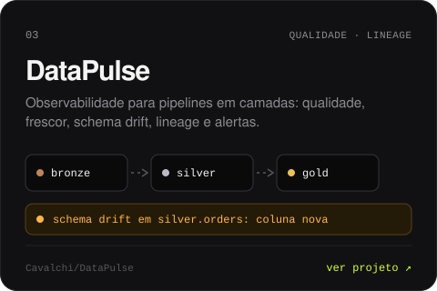
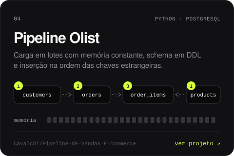

  &nbsp;
  &nbsp;
  

 

Gosto da parte da engenharia de dados que ninguém vê quando dá certo: ingestão que aguenta API fora do ar, modelo com teste antes de ir pra produção e alerta que chega antes de o dashboard começar a mentir.

Meu sonho ainda é receber uma planilha com o cabeçalho na primeira linha.

 

### Trabalho selecionado

  
  

  
  

 

### Como eu trabalho

**Pipeline sem teste é só um script otimista.** Modelo dbt sobe com teste de unicidade, nulo e relação. Se for pra quebrar, que quebre antes da reunião de segunda.

**Dado bom é dado entediante.** Chega no horário, com o mesmo schema, todo dia. Quando algo muda, alguém fica sabendo antes do usuário.

**Se ninguém consulta a tabela, ela não precisa existir.** Menos modelo, menos custo, menos coisa pra explicar depois.

**`SELECT *` não passa no meu code review.** Nem o meu.

 

Respondo mais rápido no <a href="https://www.linkedin.com/in/cavalchi/">LinkedIn</a>. Por email também chega, só demora um pouco mais.

<!--
  Assets antigos, fora de uso. Continuam em assets/ caso queira voltar com algum:
  about.svg, connect.svg, datalake.svg, divider.svg, galaxy-pipeline.svg, pipeline.svg

  Os SVGs atuais (header, card-*, btn-*) têm a fonte Geist embutida.

  Cobrinha de contribuições (gerada por .github/workflows/snake.yml):
  <picture>
    <source media="(prefers-color-scheme: dark)" srcset="https://raw.githubusercontent.com/Cavalchi/Cavalchi/output/github-snake-dark.svg" />
    <source media="(prefers-color-scheme: light)" srcset="https://raw.githubusercontent.com/Cavalchi/Cavalchi/output/github-snake.svg" />
    
  </picture>
-->
