<!-- HEADER ANIMADO CUSTOMIZADO -->
<div align="center">
  
</div>

<br/>

<!-- TYPING SVG -->
<div align="center">
  <a href="https://git.io/typing-svg">
    
  </a>
</div>

<br/>

<!-- BADGES SOCIAIS -->
<div align="center">
  
  [](https://www.linkedin.com/in/cavalchi/)
  [](https://cavalchi.netlify.app)
  [](https://github.com/Cavalchi)
  [](https://github.com/Cavalchi)

</div>

<!-- ═══════════════════════════════════════════ -->

<!-- ═══════════════════════════════════════════ -->

##  &nbsp;`> whoami`

<div align="center">
  
</div>

<br/>

> 🏎️ **Plot twist:** comecei simulando estratégias de corrida da F1 com dados reais — desgaste de pneus, ar sujo, undercut.  
> Hoje canalizo essa mesma obsessão por performance em pipelines de produção. A F1 virou hobby, mas a mentalidade data-driven ficou.

<!-- ═══════════════════════════════════════════ -->

<!-- ═══════════════════════════════════════════ -->

## 🌌 &nbsp;De Caos a Insight

<div align="center">
  
</div>

<br/>

<div align="center">
  <em>Dados brutos orbitam como estrelas numa galáxia caótica → entram no vortex do pipeline → saem limpos, estruturados e prontos pra decisão.</em>
</div>

<!-- ═══════════════════════════════════════════ -->

<!-- ═══════════════════════════════════════════ -->

## ⚡ &nbsp;Tech Arsenal

<div align="center">

<table>
<tr>
<td align="center" width="150"><strong>🐍 Languages</strong></td>
<td align="center" width="150"><strong>⚙️ Processing</strong></td>
<td align="center" width="150"><strong>🗄️ Storage</strong></td>
<td align="center" width="150"><strong>☁️ Cloud</strong></td>
<td align="center" width="150"><strong>🧰 Tools</strong></td>
</tr>
<tr>
<td align="center">
  <br/><sub>Python</sub><br/>
  <br/><sub>SQL / Bash</sub>
</td>
<td align="center">
  <br/>
  <br/>
  <br/>
  
</td>
<td align="center">
  <br/><sub>PostgreSQL</sub><br/>
  <br/>
  <br/>
  
</td>
<td align="center">
  <br/><sub>AWS</sub><br/>
  <br/><sub>GCP</sub><br/>
  <br/><sub>Azure</sub>
</td>
<td align="center">
  <br/><sub>Docker</sub><br/>
  <br/><sub>Terraform</sub><br/>
  <br/><sub>Git</sub>
</td>
</tr>
</table>

<br/>


</div>

<!-- ═══════════════════════════════════════════ -->

<!-- ═══════════════════════════════════════════ -->

## 🚀 &nbsp;Projetos em Destaque

<div align="center">

<a href="https://github.com/Cavalchi/DataPulse">
  
</a>
&nbsp;
<a href="https://github.com/Cavalchi/Pipeline-de-Vendas-E-commerce">
  
</a>

<br/>

<a href="https://github.com/Cavalchi/Dashboard_Python">
  
</a>
&nbsp;
<a href="https://github.com/Cavalchi/Bahrein-2025">
  
</a>

</div>

<!-- ═══════════════════════════════════════════ -->

<!-- ═══════════════════════════════════════════ -->

## 📈 &nbsp;GitHub Analytics

<div align="center">

  
  &nbsp;
  

  <br/><br/>

  

</div>

<!-- ═══════════════════════════════════════════ -->

<!-- ═══════════════════════════════════════════ -->

## 🐍 &nbsp;Contribution Snake

<div align="center">
  <picture>
    <source media="(prefers-color-scheme: dark)" srcset="https://raw.githubusercontent.com/Cavalchi/Cavalchi/output/github-snake-dark.svg" />
    <source media="(prefers-color-scheme: light)" srcset="https://raw.githubusercontent.com/Cavalchi/Cavalchi/output/github-snake.svg" />
    
  </picture>
</div>

> ⚠️ **Nota:** Após o primeiro push, vá em **Actions → Generate Snake Animation → Run workflow** para ativar.

<!-- ═══════════════════════════════════════════ -->

<!-- ═══════════════════════════════════════════ -->

## 🤝 &nbsp;Vamos construir algo juntos?

<div align="center">

  [](https://www.linkedin.com/in/cavalchi/)
  [](https://cavalchi.netlify.app)
  [](mailto:cavalchi@outlook.com)

  <br/>

  ```
  "Data is the new oil, but pipelines are the refinery." ⛽→🏭→💎
  ```

  <br/>

  

</div>
